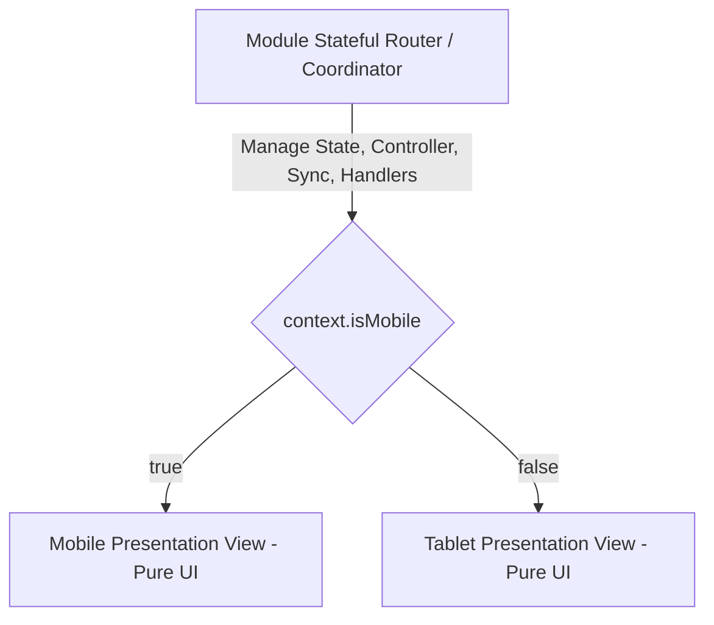

# Rencana Eksekusi Refactoring Pemisahan File Mobile & Tablet (Koreksi Presisi & Architecture Guardrails)

## Executive Summary
Dokumen ini menetapkan rencana eksekusi refactoring pemisahan file visual Mobile (`mobile_portrait/`) dan Tablet (`tablet_landscape/`) untuk modul **Sales Orders** dengan mengimplementasikan **Stateful Coordinator Pattern**, **Kontrak Identik 100%**, dan **Prosedur Audit Inkremental**.

---

## 🛡️ 3 Koreksi & Guardrail Teknis Utama

> [!IMPORTANT]
> **Terapkan 3 Koreksi Presisi:**

### 1. Presisi Import Relative Path
- Dari `lib/modules/sales/orders/views/active_orders/active_orders_view.dart`, path yang presisi adalah:
  ```dart
  import '../../../../../core/widgets/responsive/responsive_context.dart';
  ```

### 2. Kontrak Router & Nama Kelas Identik (Zero Regression)
- Nama kelas tetap menggunakan nama asli dari codebase:
  - `ActiveOrdersView`
  - `ParkedOrdersView`
  - `HistoryLiteView` (bukan `SalesHistoryLiteView`)
- Seluruh router wajib meneruskan **seluruh parameter tanpa terkecuali**:
  - `final bool embedded;`
  - `final ValueChanged<int>? onSectionSelected;`
- `Key` publik tetap dimiliki oleh router/coordinator melalui `super.key`.
  Jangan meneruskan `key` yang sama secara mentah ke mobile dan tablet view:
  khususnya `GlobalKey` akan gagal karena dipasang pada dua widget. Jika child
  memerlukan key, gunakan key internal yang unik.

### 3. Stateful Coordinator Pattern (Mekanisme Eksplisit Zero Logic Duplication)
Mencegah duplikasi `TextEditingController`, listener `OrdersHistorySyncService`, query SQLite, filter status, dan handler aksi di dua tempat.



- **Router (Coordinator)**: `StatefulWidget` yang mengelola `TextEditingController`, `ValueNotifier`, sinkronisasi, dan handler event.
- **Mobile View**: `StatelessWidget` / Pure UI presentation layer.
- **Tablet View**: `StatelessWidget` / Pure UI presentation layer.
- Model data presentasi dan tipe callback bersama ditempatkan pada file shared di
  root komponen (contoh: `active_orders_presentation.dart`), bukan pada file
  mobile atau tablet. Dengan demikian kedua device view menerima data dan aksi
  yang sama, tanpa saling mengimpor atau menduplikasi logika.

---

## Rincian Perubahan Kode Modul Sales Orders

### Component 1: Active Orders (`active_orders`)

#### [NEW] `lib/modules/sales/orders/views/active_orders/active_orders_view.dart`
```dart
import 'package:flutter/material.dart';
import '../../../../../core/widgets/responsive/responsive_context.dart';
import 'active_orders_presentation.dart';
import 'mobile_portrait/view.dart';
import 'tablet_landscape/view.dart';

class ActiveOrdersView extends StatefulWidget {
  const ActiveOrdersView({
    super.key,
    this.embedded = false,
    this.onSectionSelected,
  });

  final bool embedded;
  final ValueChanged<int>? onSectionSelected;

  @override
  State<ActiveOrdersView> createState() => _ActiveOrdersViewState();
}

class _ActiveOrdersViewState extends State<ActiveOrdersView> {
  late final TextEditingController _searchController;

  @override
  void initState() {
    super.initState();
    _searchController = TextEditingController()..addListener(_onSearchChanged);
    // Listener sinkronisasi dan initial load tetap dimulai satu kali di sini.
  }

  void _onSearchChanged() => setState(() {});

  Future<void> _refresh() async {
    // Query, filter, dan handler aksi bisnis tetap berada di coordinator.
  }

  @override
  void dispose() {
    _searchController
      ..removeListener(_onSearchChanged)
      ..dispose();
    super.dispose();
  }

  @override
  Widget build(BuildContext context) {
    final presentation = ActiveOrdersPresentation(
      searchController: _searchController,
      onRefresh: _refresh,
      onSectionSelected: widget.onSectionSelected,
      // Data order yang sudah difilter dan callback aksi lain dibentuk di sini.
    );

    return context.isMobile
        ? ActiveOrdersMobileView(
            embedded: widget.embedded,
            presentation: presentation,
          )
        : ActiveOrdersTabletLandscapeView(
            embedded: widget.embedded,
            presentation: presentation,
          );
  }
}
```

> Terapkan bentuk yang sama untuk Parked Orders dan History Lite. Router
> coordinator adalah satu-satunya pemilik state, controller, listener,
> sinkronisasi, query/filter, dan action handler. Device view hanya merender
> data yang telah disiapkan serta memanggil callback dari presentation model.

#### [NEW] `lib/modules/sales/orders/views/active_orders/mobile_portrait/view.dart`
`ActiveOrdersMobileView` (Pure UI presentation layer) menerima `embedded` dan
`ActiveOrdersPresentation`; callback `onSectionSelected` diteruskan di dalam
presentation model tanpa merubah widget tree maupun spacing.

#### [MODIFY] `lib/modules/sales/orders/views/active_orders/tablet_landscape/view.dart`
Ubah nama kelas ke `ActiveOrdersTabletLandscapeView`, terima `embedded` dan
presentation model yang sama, serta bersihkan dari kode mobile.

---

### Component 2: Parked Orders (`parked_orders`)

#### [NEW] `lib/modules/sales/orders/views/parked_orders/parked_orders_view.dart`
Thin Router dengan kontrak identik (`embedded` & `onSectionSelected`).

#### [NEW] `lib/modules/sales/orders/views/parked_orders/mobile_portrait/view.dart`
`ParkedOrdersMobileView` (Pure UI) menerima presentation model dari
coordinator, bukan membuat state atau listener sendiri.

#### [MODIFY] `lib/modules/sales/orders/views/parked_orders/tablet_landscape/view.dart`
`ParkedOrdersTabletLandscapeView` (Pure UI Tablet) menerima presentation model
yang sama dari coordinator.

---

### Component 3: Sales History Lite (`history_lite`)

#### [NEW] `lib/modules/sales/orders/views/history_lite/history_lite_view.dart`
Thin Router dengan kontrak identik nama kelas `HistoryLiteView` (`embedded` & `onSectionSelected`).

#### [NEW] `lib/modules/sales/orders/views/history_lite/mobile_portrait/view.dart`
`HistoryLiteMobileView` (Pure UI) menerima presentation model dari coordinator.

#### [MODIFY] `lib/modules/sales/orders/views/history_lite/tablet_landscape/view.dart`
`HistoryLiteTabletLandscapeView` (Pure UI Tablet) menerima presentation model
yang sama dari coordinator.

---

## 🧪 Rigorous Module Verification & Audit Commands

Setelah eksekusi modul Sales Orders selesai, wajib dijalankan audit berikut.
Audit ini melarang keputusan perangkat di folder tablet, tetapi tetap
mengizinkan `MediaQuery` untuk ukuran, spacing, atau constraint layout tablet.

### 1. Static Analysis Check
```bash
flutter analyze lib/modules/sales/orders/views/
```
Memastikan **0 error dan 0 warning baru** pada modul. Jika ada issue yang
sudah ada sebelumnya, catat sebagai baseline terpisah dan jangan menambahnya.

### 2. Isolation Audit (Grep/Ripgrep Audit Commands)
```bash
rg -n 'context\.(isMobile|isTablet)|shortestSide\s*[<>=!]+\s*600|screenWidth\s*[<>=!]+\s*600' \
  lib/modules/sales/orders/views/*/tablet_landscape/
rg -n 'mobile_portrait' lib/modules/sales/orders/views/*/tablet_landscape/
```
Memastikan **0 hasil**: folder `tablet_landscape/` tidak lagi memilih UI
mobile/tablet atau mengimpor presentation view mobile. `MediaQuery` untuk
layout tablet tidak dianggap pelanggaran isolasi.

### 3. Smoke Test Functional Check
- Pengujian alur pencarian, tab filter status order, sheet detail order, tombol refresh, dan navigasi pindah sub-menu pada layar Mobile & Tablet.
